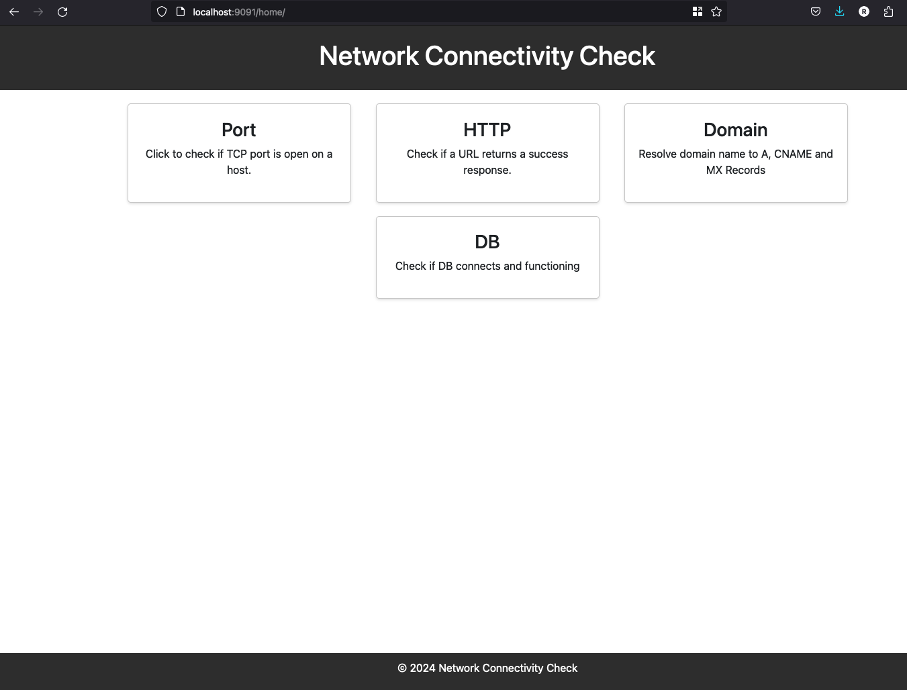
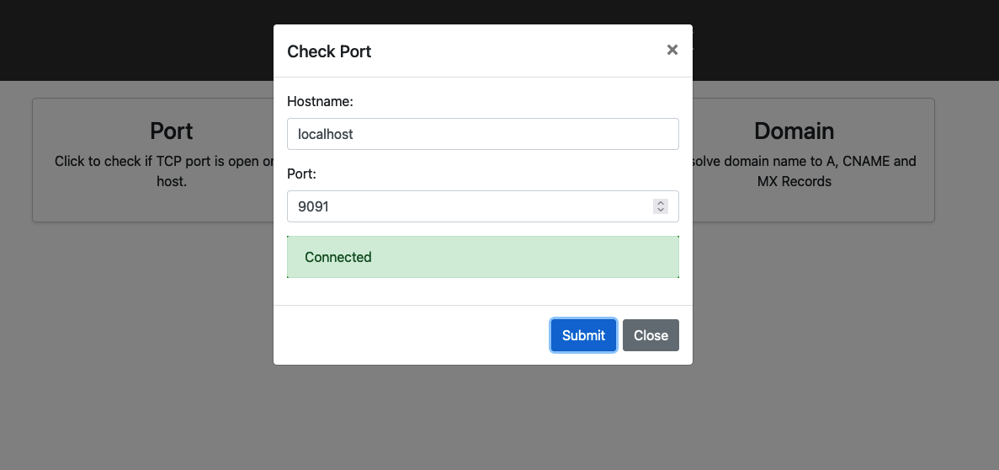
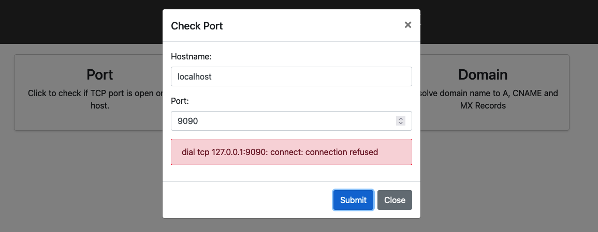
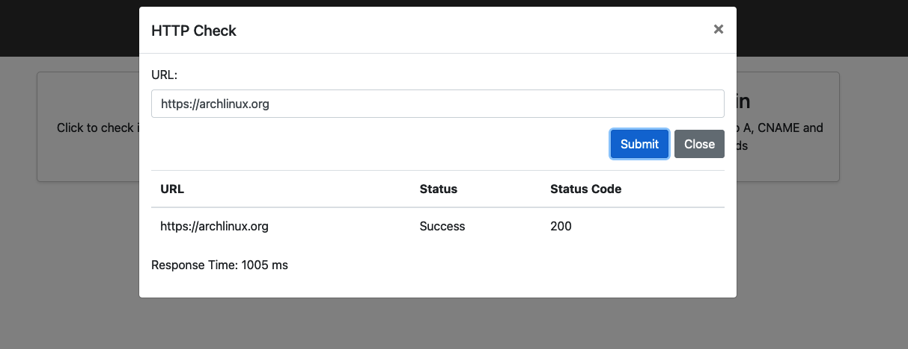
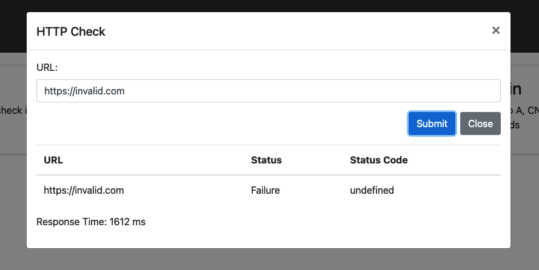
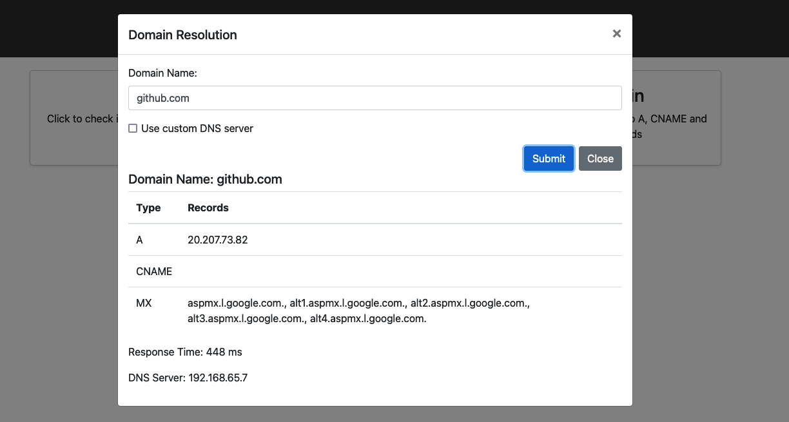
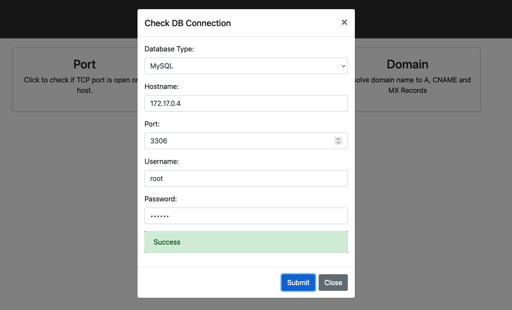

# Introduction
 A simple UI that does basic network checks, Its for people who doesnt have time for or access to CLI.

 This was a personal project aimed at assessing connectivity across subnetworks once firewall access was authorized and implemented. The container image makes it easy to deploy it on managed services such as EKS, AKS, App Services & ECS.

# Pre requisites
 You can run it directly on your local machine either using Docker/Podman or by executing Go commands.

 ## Go
  ```
  go run main.go
  ```
 ## Docker
  ```
  docker run -it --rm  -p 9091:9091 ghcr.io/rdev2021/network-test:latest
  ```

  http://localhost:9091/home/ to launch the home page of the application.


# Screenshots
 ### Home Page
 
 ### Port Check
 
 
 ### Http checks
 
 
 ### Domain checks
 
  ### Database checks
 

